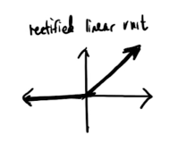

# Neural-network-from-scratch-no-libraries

Following the Samsong Zhang video + the 3b1b video + my own intuition and random assumptions midway (I will only partially watch the videos and try to make a program with the half-knowledge I obtain as a fun exercise.)

ALSO: NO AI DURING ANY PROCESS. NOT EVEN STUFF LIKE DEBUGGING OR RESOURCE FINDING. I will strictly limit myself to google searches, reddit posts, stack-overflow and youtube.

# Problem Statement

We will be tackling the digit classification problem using the MNIST database.

# The Math

28x28 pixel training images. (784 pixels, m training images)
Each pixel will have value from 0 to 255.

We can represent it as a matrix,

Each row will constitute an example, each row will be 784 columns long as each will correspond to one pixel in the image.
We will transpose that matrix to obtain a matrix where each column is a training example and it will have 784 rows corresponding to each pixel.

# The Goal

Use the dataset to train the model and predict digits.

# Structure

2 layers
0th layer = 784 nodes -> Input layer
1st layer = Hidden layer -> 10 units
2nd layer = Output layer -> 10 units

# Forward-Propagation

We take an image and run it through the network to compute what the output is going to be.

## The Math p2
A_0 = X -> (784 x m)

// The general formula to determine the values for each of the nodes in the 1st hidden layer is:

Z_1 = W_1 * A_0 + b_1 

*((10 x m) = (10 x 784)(784 x m) + (10 x 1))*

// If we only have linear combinations in each layer then we won't have an interesting function out of our neural network. It will just return in some fancy linear regression model. To solve this, we use an activation function for the hidden layer. This will introduce complexity into our model and make it a better predictor.

// Some activation functions are: ReLU (Rectified Linear Unit), tanh, sigmoid, etc.

A_1 = ReLU(Z_1)

// For the second layer, we will use a different activation function (it is the output layer so we can't use ReLU. We want each number to have some probability output. 1 meaning absolutely certainty and 0 meaning absolutely not possible.)

// For this objective, we will use the softmax function

A_2 = softmax(Z_2)

| 1.3 |                                   | 0.02 |
| 5.1 |                                   | 0.90 |
| 2.2 | -> Softmax Activation function -> | 0.05 |
| 0.7 |                                   | 0.01 |
| 1.1 |                                   | 0.02 |

// Softmax Activation Function = e^(Z_i) / (sum from j = 1 to k (e^(Z_j)) )

# Backwards-Propagation

We predict using initial state, we look at error and we adjust the values of weights and biases using concept of gradient descent. 

// Errors are computed (Y is the actual output, dZ_2 is the error of output layer)

dZ_2 = Z_2 - Y

*((10 x m) = (10 x m) - (10 x m))*

// We will one-hot encode the correct label, if Y = 4, we won't subtract 4 from this. We just encode Y = 4 into the array. 

// Derivative of loss functions with respect to the weights at 2
dW_2 = (1 / m) * dZ_2 * A_1Transpose

*((10 x 10) = (10 x m)(m x 10))*

db_2 = (1 / m) * Sum(dZ_2)  -> Average of the absolute error

*((10 x 1) = (10 x 1))*

dZ_1 = W_2Transpose * dZ_2 * (derivative of activation function at Z_1)

*((10 x m) = (10 x 10) (10 x m) (10 x m))*

dw_1 = (1 / m) * dZ_1 * XTranspose

*((10 x 784) = (10 x m) (m x 784))*

db_1 = (1 / m) * sum(dZ_1)

*((10 x 1) = (10 x 1))*

## Parameter updating

W_1 = W_1 - (learning rate) * dW_1
b_1 = b_1 - (learning rate) * db_1
W_2 = W_2 - (learning rate) * dW_2
b_2 = b_2 - (learning rate) * db_2

### All of this keeps getting repeated.

That is it for the theory