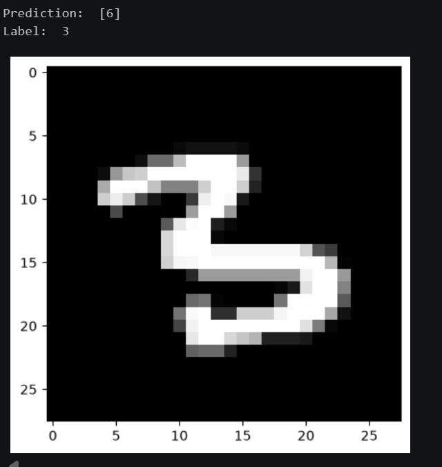

# Neural Network From Scratch - MNIST Digit Classification

A 2-layer Feed Forward Neural Network implemented using Numpy, Pandas and Matplotlib only. No machine learning libraries. It classifies handwritten digits from the MNIST dataset. Manual Implementation.

## Overview

* Architecture: 784 nodes at input -> 10 hidden ReLU nodes -> 10 output softmax nodes
* Input: 28x28 grayscale digit images, flattened into 784-pixel vectors
* Training method: Gradient descent with manually derived backpropagation
* Result: ~84% accuracy after 500 iterations. ~2 min training time.

## Requirements

* Numpy
* Pandas
* matplotlib

## Model predicting incorrectly

